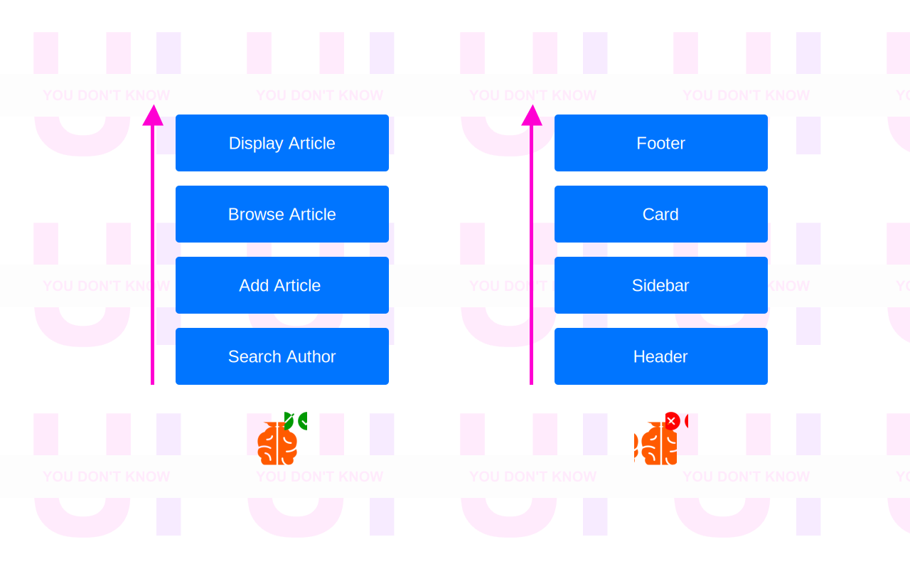
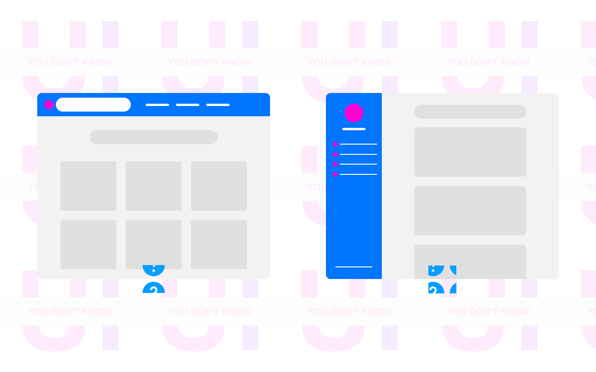
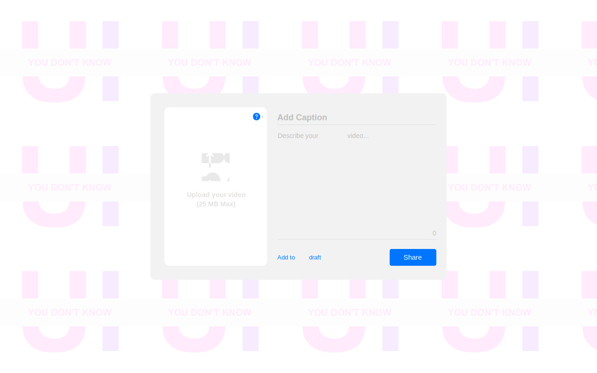

   
  <h1>You Don't Know UI</h1>
  <h3>You don't need to be a 10X designer to create universal user interfaces</h3>

---

Inspired by [KYLE SIMPSON](https://github.com/getify)'s book [You Don't Know JS](https://github.com/getify/You-Dont-Know-JS), I decided to create [You Don't Know UI](https://github.com/You-Dont-Know-UI) which is a DESIGN PRO TIPS dedicated for developers to learn, discuss, contribute together and share the best practices about designing user interfaces.

Back to 2017, I started to spent my spare time to learn in-depth about Web Design, Mobile Design, Animation, Micro-Interaction, User Experience and Design Systems by reading several books and articles such as [Refactoring UI](https://refactoringui.com/) by [Adam Wathan](https://github.com/adamwathan) & [Steve Shoger](https://www.steveschoger.com/), [Invision Design System Handbook](https://www.designbetter.co/design-systems-handbook), [Atomic Design](https://bradfrost.com/blog/post/atomic-web-design/) by [Brad Frod](https://github.com/bradfrost), [Airbnb Design System](https://github.com/airbnb), asking questions on [User Experience Platform](https://ux.stackexchange.com/), and sharing my personal [prototypes](https://www.behance.net/menaialaeddine) on Behance. Also, I started sharing these Tips 2 months ago on [Linkedin](https://www.linkedin.com/in/alaedddine/) but they are not professional and more detailed like here.

From basic to advanced: test how well your UI is modern, consistent, universal, and accessible, refresh your workflow a bit, or enhance the product you're working on! :muscle: :rocket: I update this repo regularly with new PRO TIPS. I added examples to make the explanations more tangible. good luck! :heart:

--- 

<b>1. Think in a feature, not a layout</b>

I've wasted months not just days trying to create an MVP ( Minimal  Viable Product ) for an idea. I spent nights and nights refactoring the user interfaces by changing just the places of the components and the layouts. Don't be stupid like me!

When you start designing a new user interface for a web or mobile application, most of the time you think about the **structure** or the **position** of your components, so you start designing the Header or the Top Navigation as your first component in your UI. Me too I was doing this mistake!

Do you know why it's a mistake? Because you're limiting yourself from the beginning. Because you're seeing the App Design from Top-To-Down or Down-To-Top while the App Design is a **collection of features**. You're not building a house here using LEGO bricks! But you're building a car and you can start designing the engine or the wheels, right?

Most of the folks try to _copy & paste_ from popular websites and apps, without knowing the Standards or the Design Decisions for each product. This is the easiest way to find themselves _frustrated_, _limited_ and they figure out that they overthink only on _Generic Things_.

They focus on the _shape_ of their app but not the _core features_, and they start asking frequently these questions :

<i>    Where should I put the Logo?</i>

<i>    How many items should I have in the navigation bar? </i>

<i>    Should I have one or two sidebars?</i>

<i>    Should I have a Grid Layout or a Table of items?</i>

But, what you don't know ( maybe ) is UI Components are made to solve certain problems that's related to _user interaction_, _data displaying_ or _new device screen invention_, and you may be noticed that _Humburger_ element is started to be well-known in mobile devices.
 
Obviously, we are not designing user interfaces but we are designing and implementing features, and Top Navigation is just a _common feature_ that helps users to do quick navigation for certain and most important pages.

So, don't care about common features or what I call them _Generic features_ or _layouts_.

Instead of starting by a _layout_, start with a _feature_ or a _specific functionality_ , and not any _feature_ but the _core feature_ in your product.

Let's say you'll build the next-gen social media app for sharing videos. You could start with this **core feature** : Share a short-form video.

The UI will need :

<i>   Field for upload a video</i>

<i>   Field for the caption</i>

<i>   Field for the description</i>

<i>   Button for posting or sharing</i>

<i>   Button for saving in draft</i>

These are the requirements to design your UI.

[Edit →](https://github.com/MenaiAla/You-Dont-Know-UI/pulls)

---
