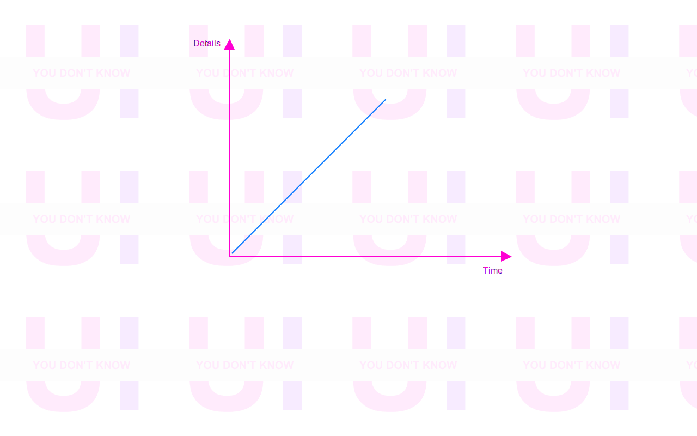
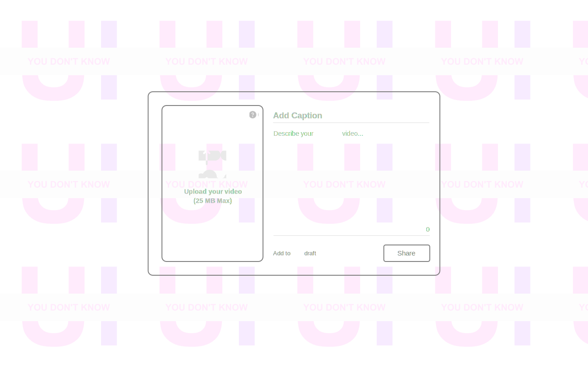
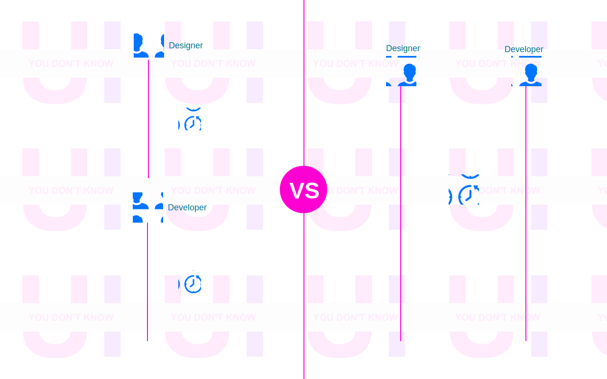
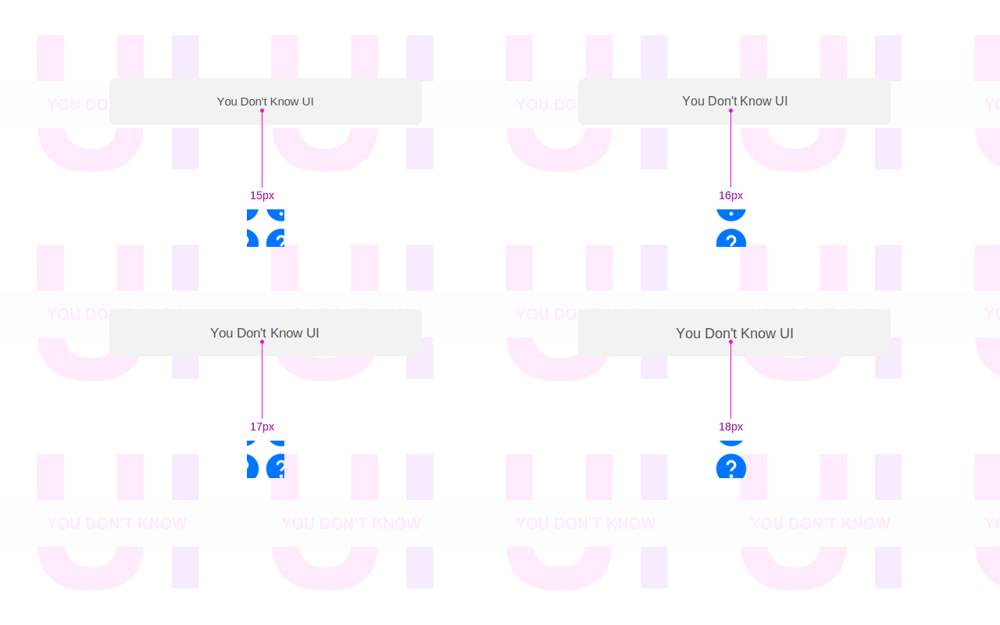
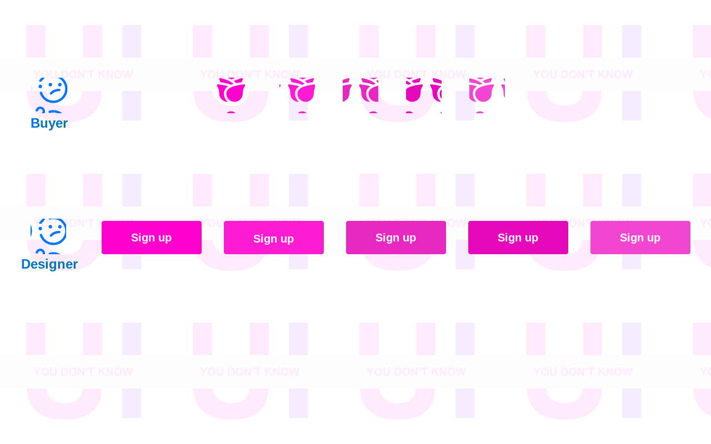
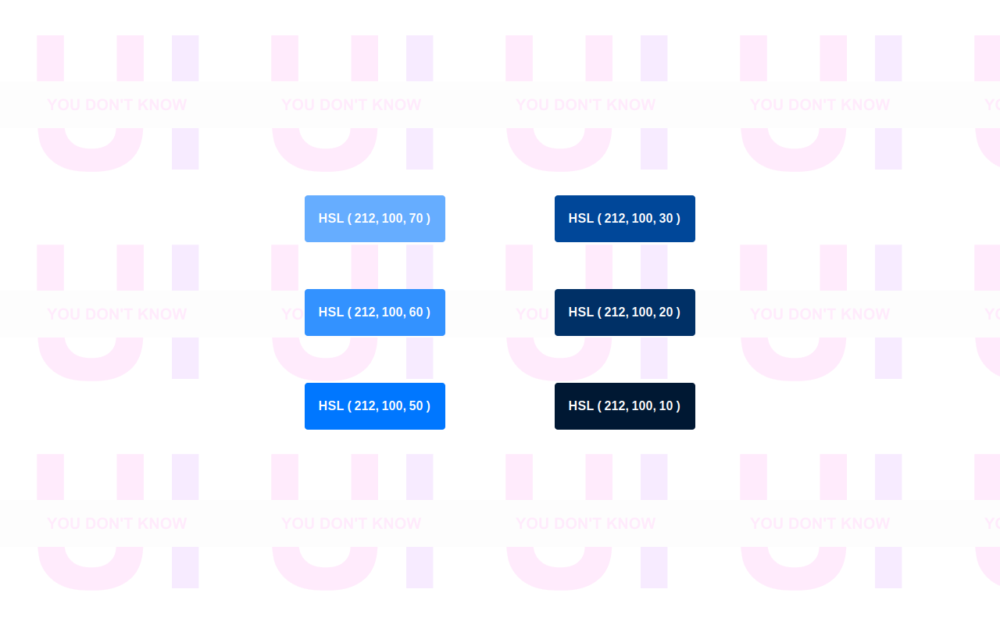
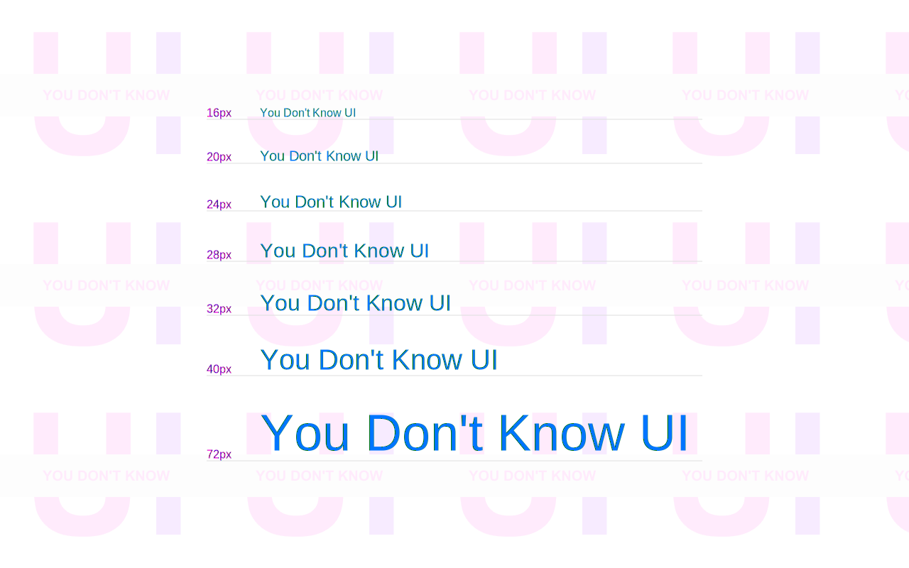
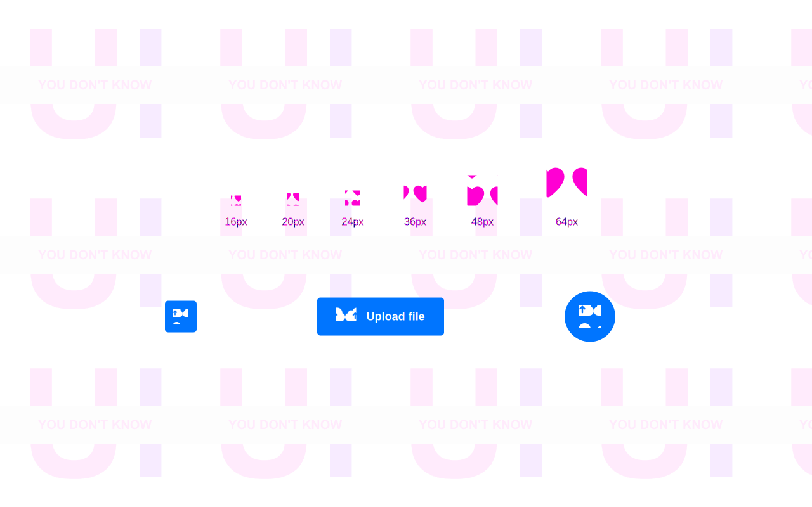
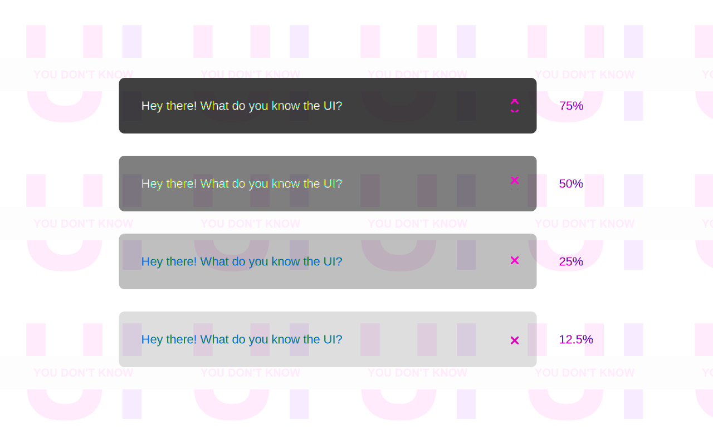
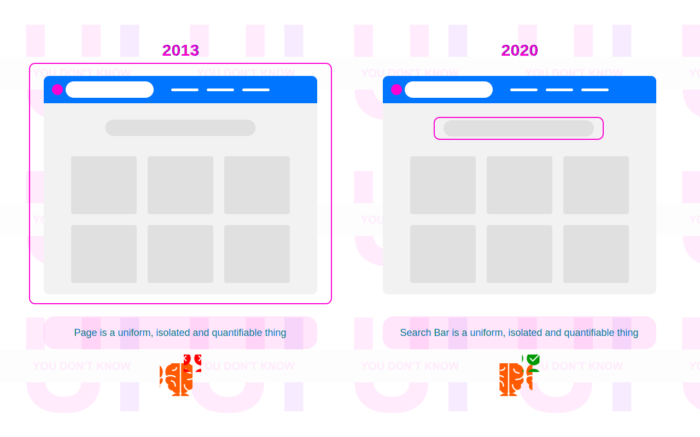

<div align="center">
   
  <h3>Learn how to build universal, modern and scalable user interfaces</h3> 
</div>

---

<div>

## :muscle: Motivation


<span>Inspired by the title of [KYLE SIMPSON](https://github.com/getify)'s book [You Don't Know JS](https://github.com/getify/You-Dont-Know-JS), I decided to create [You Don't Know UI](https://github.com/You-Dont-Know-UI) which is a collection of detailed pro tips about designing and developing modern user interfaces.

Back to 2017, I started to spend my spare time to learn in-depth about Web Design, Mobile Design, Animation, Micro-Interaction, User Experience and Design Systems by reading several books and articles such as [Refactoring UI](https://refactoringui.com/) by [Adam Wathan](https://github.com/adamwathan) & [Steve Shoger](https://www.steveschoger.com/), [Invision Design System Handbook](https://www.designbetter.co/design-systems-handbook), [Atomic Design](https://bradfrost.com/blog/post/atomic-web-design/) by [Brad Frod](https://github.com/bradfrost), [Airbnb Design System](https://github.com/airbnb), asking questions on [User Experience Platform](https://ux.stackexchange.com/), and sharing my personal [prototypes](https://www.behance.net/menaialaeddine) on Behance. Also, 2 months ago I started sharing design tips for front-end developers on [Linkedin](https://www.linkedin.com/in/alaedddine/) but they are not professional and more detailed like here.

---

## :bouquet: Value

From basic to advanced: test how well your UI is modern, consistent, universal, and accessible, refresh your workflow a bit, or enhance the product you're working on! :muscle: :rocket: I update this repo regularly with new PRO TIPS. I added illustrations to make the explanations more tangible. good luck! :heart:

</span>

</div>

---

## :rocket: Get Started


#### How to build your user interfaces from scratch?

---

<details><summary><b>1. Think in a feature, not a layout</b></summary>
<p>

I've wasted months not just days trying to create an MVP ( Minimal  Viable Product ) for an idea. I spent nights and nights refactoring the user interfaces by changing just the places of the components and the layouts. Don't be stupid like me!

When you start designing a new user interface for a web or mobile application, most of the time you think about the **structure** or the **position** of your components, so you start designing the Header or the Top Navigation as your first component in your UI. Me too I was doing this mistake!


Do you know why it's a mistake? Because you're limiting yourself from the beginning. Because you're seeing the App Design from Top-To-Down or Down-To-Top while the App Design is a **collection of features**. You're not building a house here using LEGO bricks! But you're building a car and you can start designing the engine or the wheels, right?

Most folks try to _copy & paste_ from popular websites and apps, without knowing the Standards or the Design Decisions for each product. This is the easiest way to find themselves _frustrated_, _limited_ and they figure out that they overthink only on _Generic Things_.

They focus on the _shape_ of their app but not the _core features_, and they start asking frequently these questions :

<i>    Where should I put the Logo?</i>

<i>    How many items should I have in the navigation bar? </i>

<i>    Should I have one or two sidebars?</i>

<i>    Should I have a Grid Layout or a Table of items?</i>


But, what you don't know ( maybe ) is UI Components are made to solve certain problems that's related to _user interaction_, _data displaying_ or _new device screen invention_, and you may be noticed that _Humburger_ element is started to be well-known in mobile devices.
 
Obviously, we are not designing user interfaces but we are designing and implementing features, and Top Navigation is just a _common feature_ that helps users to do quick navigation for certain and most important pages.

So, don't care about common features or what I call them _Generic features_ or _layouts_.

Instead of starting by a _layout_, start with a _feature_ or a _specific functionality_ , and not any _feature_ but the _core feature_ in your product.

Let's say you'll build the next-gen social media app for sharing videos. You could start with this **core feature** : Share a short-form video.

The UI will need :

<i>   Field for upload a video</i>

<i>   Field for the caption</i>

<i>   Field for the description</i>

<i>   Button for posting or sharing</i>

<i>   Button for saving in draft</i>

These are the requirements to design your UI.


[Edit →](https://github.com/MenaiAla/You-Dont-Know-UI/pulls)

</p>
</details>

---

<details><summary><b>2. Design few, Implement few, Repeat</b></summary>
<p>

I have this question for you:

<i>    Why do you need to design a perfect user interface with all details and then implement it?</i>

I have another question for you:


<i>    Did you feel frustrated in the stage of implementation of a new feature because the design does not consider programming limits?</i>

My last question is:

<i>    Why do you focus on details in the early stage of the design?</i>

Ha! I know you're thinking in Agile but you're working with the Waterfall approach.

Indeed, people get confused when they switch from one task to another per day even in the same domain, it happened to me usually, especially when it comes to designing different concepts of user interfaces per day.

Furthermore, people want to start a thing and finish it one time. They want to make it perfect from the beginning! Even with **low resource** and in **limited time**. It happens most of the time in early-stage **startups**.

So, let me tell you something: **Details do not matter when you start from scratch.**

The hard thing about the design is when someone asks you: Why did you take this decision?

<i>    Why you chose this palette of colors?</i>

<i>    Why you chose this typface?</i>

<i>    Why you chose this style of icons?</i>

If you don't have a Design System in place, creating **consistent** user interfaces is very hard, and focusing in-depth on **details**, will lose **time**, **effort**, and of course the **consistency** of your user interfaces.



So, what's the solution here?

As I mentioned in the title: **Design few, Implement few, Repeat.**

In the earliest stage of the new design or new feature, you don't need to stick to the **high-level** decisions about the foundation of your design ( Spacing, Color, Typography, Iconography). I know they matter but not in the beginning, right?

Let's say, when you were having a shower you came up with an idea for a new killer feature, and you want to make it more tangible for your teammates and the stakeholders to get buy-in. Adding new features means a new investment of money and time and what matter later for any company is: **Revenue**.

The first thing, you need to do is ignore all details ( nice-to-have ) and just focus on the requirements ( must-to-have ).

So, I recommend this workflow to get quick both **internal** and **external** feedback:

  Create hand-drawn version.


As you see here, there are zero details about your user interface in production, but why this step matters?

This hand-drawn activity may take between 5min and 20mins if you want to make it **high-fidelity** draw! 

In fact, this step will help you to see other teammates and stakeholder's opinions and gather  **individual recommendations** from each member in your team. People could not recommend changes when they see a well-done thing. But they can tell you how can you make it better when you deliver it **clean** but **uncomplete** and **ugly**. It's human nature.


   Ignore colors.



When I was a kid, I remember my Dad when he was buying a paint book for me. The content was grayscale images and my mission was to colorize these images using wood colors. Sometimes, I and my friend have the same image but when we colorize we end up with different looks! After that, we go to family members and ask them which one is better.

But how can we adopt this workflow in our design?

The idea is to **hold the color** even if you'll refine your design in higher fidelity. Let people tell you how are the **shapes**, **sizes**, **spaces** and the **position** of your elements.

  Implement the UI.

Modern frameworks and libraries such as [Vue](https://vuejs.org/), [React](https://reactjs.org/) and [Svelte](https://svelte.dev/) were created for **Rapid Prototyping** which means you can implement one component and use it with **different looks** in **different positions**. So, you don't need to have a **full prototype** with all user interfaces to start the implementation.

It's a little bit challenging, but I can say that you don't need to regret the time you spent for designing **perfect UI** that you'll never see it on production.

The goal of this step is to test the **back functionality** ( How it works ) of the UI without sticking on how it looks for users.

  Colorize.

If you don't have a color palette in place, you can try several colors and see the consistency between them based on color theory rules.


  Repeat.

Our purpose here is to prevent the **over investing** and moving fast by doing **parallel iterations** on both design and code in **short time**, so you can build real thing as soon as possible. In the end, what matters is your UI in production.




[Edit →](https://github.com/MenaiAla/You-Dont-Know-UI/pulls)

</p>
</details>

---

<details><summary><b>3. Details Matter, But Later</b></summary>
<p>

<i>    Which option will delight the users?</i>

This is the frequent question I ask myself in my work basis. Hope I'm not the only one!

Designers and engineers waste more time on details and minor decisions in the early stage of designing and implementing new UI but they should realize that designing UI is an **iterative process**. In fact, it's better for you to not stick on minor details in the early stage of any task. You don't want to hear from me how many hours or maybe days I spent changing the font size by adding or reducing **1px**.

 


<i>   Do you think that users will notice these changes?</i>

<i>   Do you think that adding 1px will add more revenue to the company?</i>

Please, don't waste your time on these changes in the early-stage.

From [Speed Dating Decision Making – Why Less Is More:](http://www.scientificamerican.com/article.cfm?id=speed-dating-decision-making-why-less-is-more)

Yet new research does point out a different dating problem: being confronted with a **large number of choices can make it harder to make a good decision**. In fact, it can even prevent you from making a decision in the first place.

When you're designing without constraints, your process will be very slow, and you will never end up with a choice. Let me clarify with this example:


 

As you see in the above image, the first scenario is for a buyer who wants to choose a flower for his wife but he's seeing flowers with different colors and they are almost similar which makes the decision so hard for him. The second scenario is for a designer who gets confused between these buttons where it's almost to see the difference between their background colors.

The fact is when there were **too many choices** people became confused and didn’t make a choice when there were too many options. People that had few options chose more often and were happier with their selection. So, you need to stick this rule in your head: **Limit your choices**.

So how can we limit our choices for our user interfaces?


  Systematize colors:

When I was a student, I remember when we were working on the design of the website with my teammate, and because we had not a system for the colors, we were picking a color randomly each time from the color picker and we see how the color looks in the UI. But after I discovered and read [Material Design](https://material.io/), I figure out how companies choose their colors.

So, instead of hand-picking values randomly, create your palette from the beginning, there are dozens of online generators that can help you to make your decision. You can choose from 6-8 shades and expand when you need more colors.

 

  Choose one or two font families:

It's hard to achieve consistency in UI and most of the time **over designing** is the reason behind losing it.

Having more than two font families will make your brand less-memorable like the logo and the content becomes more inconsistent for the reader. Obviously, choosing the font family is very hard in the early stage and my recommendation is **to choose the one that fits the personality of the product.**


  Systematize font size:

Similarly, don't do what I was doing by adding or reducing 1px until it looks perfect. You may waste 2 hours without taking a decision. Instead, create a stylesheet for your typescale in advance.





  Systematize icon sizes:

Defining a system for the sizes of the icons in advance will save you time later.

For example, you can constraint yourself by 4-based or 6-based scale. Your options will be :

12px, 16px, 20px, 24px, 36px, 48px, 64px.





  Sytematize opacity values:

Opacity values confuse me a lot because it's so hard to see the difference between them.

Personnally, I choose a 5-based opacity-scale and I limit myself by 4 values:

12.5%, 25%, 50%, 75%.

In CSS3, this is equivalent to:

 ```css
    opacity:0.125;
    opacity:0.25;
    opacity:0.5;
    opacity:0.75;
 ```




Having some choice is better than having no choice at all. But there is a limit. As it turns out, having more choices isn’t always a good thing.

[Edit →](https://github.com/MenaiAla/You-Dont-Know-UI/pulls)

</p>
</details>

---

<details><summary><b>4. Create design systems, not pages</b></summary>
<p>

In my second year of computer science study, our web development teacher gave us a home challenge which is creating a simple dynamic web application with HTML, CSS3, JavaScript, PHP, and MySQL. In fact, I was not a big fan of PHP and MySQL because I like to show people what I made and by nature, people love the **appearance** of the thing. Most of the time I was looking for a way to let my classmates and our teacher say **Wow**! How could you build it? Thank you to JQuery of course.

In the past, before I start any web project, the first step I get used to doing is browsing a **template** that fits the **domain** or the **personality** of the application. I was spending sometimes a **day** to make the decision.

Obviously, finding the right **template** was not a thing to think about it, but customize and edit the source code based on my needs was the hardest challenge for me.

Before I download the template, I was checking the number of **pages**, the weight of each **page**, the structure of **CSS3**, and the complexity of **JavaScript** code. Indeed, I was facing a big problem with **extending** the template by creating my **customizable** pages that looks consistent with others even I use its **CSS3** classes.

I was asking myself:

<i>   How long will that page take to build?</i>

<i>   How will it looks consistent with other pages?</i>


<i>   How can I extract the components and build new page with them?</i>


I was considering the page as an **isolated**, **uniform** thing. The fact is the **components** or the **elements** that make that page **consistent**  are the **uniform**, **isolated** and **quantifiable** thing.




The image above describes my mindset about web elements. On the left, It's the **monolithic design** and in the right, it's the **modular design**.

### Modular Design

Brad Frost released a book called: The Atomic Design. When you read this book you'll discover how Brad Frost explained the web design inspired by the world of Atoms. What's matters for us now, is how to create **modular** user interfaces that become **maintainable** in the future.

Making your UI modular means breaking the large and complex visual explorations into smaller chunks, called **elements** or **components**, which save us **time**  and make the user interfaces more **consistent**.

With the rise of new methodologies for architecture CSS3 such as BEM, OOCSS, and SMACSS, and the modern frameworks such as Bootstrap, Semantic UI, and Foundation, designers and developers spend less time to design **scalable** and **maintainable** user interfaces.

So these frameworks address the need of **rapid prototyping** by providing **customizable**, **well-tested**, and **ready-to-use** components.

However, even these front-end frameworks provide a _specific_ solution for speed up the development, the end-user interface will be the same for different brands!

This is one of the cons of these frameworks, because everyone uses the same **components** and **layouts** to design the page.  Imagine Facebook, Amazon, and Apple use the same UI framework to build their user interface, you'll find the same UI with different colors!

Furthermore, creating **customizable** components using these frameworks means following their **conventions**, **code structure** and **styleguide**. So the developers need to understand the architecture and the API of these frameworks which means invest more time for learning.


### Design Systems, The future of UI development

Do you know [Material Design](https://material.io/design/)? If yes, this is what I'm talking about.

[Alla Kholmatova](https://medium.com/@craftui) said there's not a standard definition of “design system” within the web community and people use the term in different ways, but she defined it as :

> A set of interconnected patterns and shared practices coherently organized to serve the purpose of a digital product. Patterns are the repeating elements that we combine to create an interface: things like user flows, interactions, buttons, text fields, icons, colors, typography, microcopy. Practices are how we choose to create, capture, share, and use those patterns, particularly when working in a team.

So instead of consuming built-in UI patterns from Bootstrap, you'll design and develop your own patterns by creating your own **standards** and **style guide**. If you're deciding to create a social media app, for instance, you'll need to create your own **like**, **comment**, and **share** components that distinguish your application from your competitors. Also, if you'll create **Data Visualization** platform, 
**charts**, **progress bars** are the most potent component you need to build your user interfaces.  The idea is instead of creating **templates** each time, you'll create your own **UI System** that empowers you to build several products by influencing brand factors. These design patterns will create a mental model for your users and customers.

#### But what are the benefits of design systems?

Before we use any technology or approach we need to know its benefits. Let’s take a look at the many ways a design system can be a much-needed painkiller for your growing pains.

  Consistency:


Standardized components used consistently and repetitively create a more predictable and easy to understand the application. Standardized components also allow designers to spend less time focused on style and more time developing a better user experience.

  Prototype faster:


When your product grows, you need to delight your customers by delivering new features. In the past, this means producing new code and start the development from scratch. But with a design system in place, you need only to iterate and integrate your UI patterns together to develop the feature.


  Quick iterations:

 The design system reduces effort from hundreds of lines of code to as little as a few characters. This makes iterations quick and painless, and experimentation much faster.


In conclusion, design systems are not a fad or even an untested hypothesis. For the design to find the scale necessary to match the rapid growth of technology, component-based design and development is a proven and dependable solution.

I've tried to show you the power of design systems and their impact on user interfaces. If you want to learn in-depth about the design systems, I'd recommend these books:

→  [Invision Design System Handbook](https://www.designbetter.co/design-systems-handbook)

→  [Atomic Design](https://bradfrost.com/blog/post/atomic-web-design/)

[Edit →](https://github.com/MenaiAla/You-Dont-Know-UI/pulls)

</p>
</details>

---
